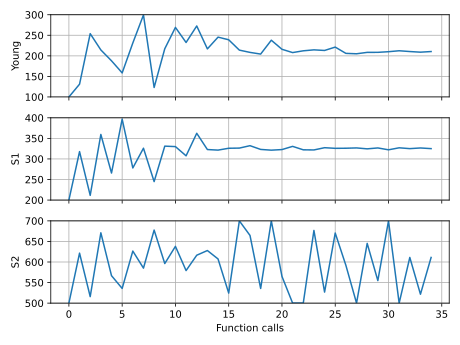

# Fitting example - Abaqus solver

A fitting example is included to demonstrate how to use `piglot` with the `Abaqus` solver.

A 2D plane-strain simulation with plasticity of a ductile material (steel), is subjected to a uniaxial constant displacement of 2 mm prescribed in 100 load increments with time-steps of 0.02 seconds.

The matrix material phase constitutive behavior is governed by the von Mises isotropic elasto-plastic constitutive model with isotropic hardening. 

A mesh with 400 CPE4 elements is considered for discretisation (the body dimensions are 200x50x5 mm). The mesh and boundary conditions can be seen as follows:


We want to find the values for the Young Modulus, the Yield Stress and a second stress point that will define the linear plasticity curve. The defined Poisson's ratio is 0.3 and the two strain values for the plasticity curve 0 and 0.25 respectively.
The notation `Young`, `S1` and `S2` is respective to the Young modulus, the Yield Stress and the second stress value.

The reference force-displacement response is computed using the following values for these parameters: `Young: 210`, `S1: 325` and `S2: 600`. The reference response is provided in the `examples/abaqus_solver_fitting/reference.txt` file. The parameters used for the reference simulation are provided in the following table:

We run 20 iterations using the `botorch` optimiser within the [curve fitting setting](../sample_curve_fitting/description.md).

The configuration file (`examples/abaqus_solver_fitting/config.yaml`) for this example is:
```yaml
iters: 20

optimiser:
  name: botorch
  n_initial: 1
  n_test: 0
  beta: 1
  acquisition: ucb


parameters:
  Young: [100, 100, 300]
  S1: [200, 200, 400]
  S2: [500, 500, 700]


objective:
  name: fitting
  solver:
    name: abaqus
    abaqus_path: C:\SIMULIA\Commands\abaqus.bat

    cases:
      'sample.inp':
        job_name: Job-1
        step_name: Step-1
        instance_name: Part-1-1
        fields:
          'reaction_x':
            name: FieldsOutput
            set_name: RF_SET
            field: RF
            x_field: U
            direction: x
   
  references:
    'reference.txt':
      prediction: reaction_x
      loss: nmse
```
The input data file for running `Abaqus` is given in `examples/abaqus_solver_fitting/sample.inp`, where the notation `<Young>`, `<S1>` and `<S2>` indicates the parameters to optimise.

To run this example, open a terminal inside the `piglot` repository, enter the `examples/abaqus_solver_fitting` directory and run piglot with the given configuration file
```bash
cd examples/abaqus_solver_fitting
piglot config.yaml
```
You should see an output similar to
```
BoTorch: 100%|███████████████████████████████████████████████████████| 20/20 [07:20<00:00, 22.05s/it, Loss: 2.9080e-06] Completed 20 iterations in 7m20s                                                                                        Best loss:  2.90797517e-06                                                                                              Best parameters                                                                                                         - Young:   209.978217                                                                                                   -    S1:   324.156389                                                                                                   -    S2:   649.619207 
```
Note that despite the fact that the optimal parameters are not exactly the same as the ones used to compute the reference response, the loss function value is very small, and the fitting is excellent as can be seen in the figures below.

To visualise the optimisation results, use the `piglot-plot` utility.
In the same directory, run (this may take some time)
```bash
piglot-plot animation config.yaml
```
This generates an animation for all the function evaluations that have been made throughout the optimisation procedure for the two target objectives.
You can find the `.gif` file(s) inside the output directory, which should give something like (for the `minimum_value` target):


Now, try running
```bash
piglot-plot parameters config.yaml
```
This will plot the evaluated parameters during the optimisation procedure: 



To see the convergence history of the best loss function value, run
```bash
piglot-plot history config.yaml --best --log
```
which will generate:


To see the best-observed value for the optimisation problem, run
```bash
piglot-plot best config.yaml
```
which will generate:


## Fitting example - Abaqus solver with composite setting

This subsection aims to show the difference in the results obtained using the composite option. Convergence is more stable, a smaller loss is achieved and the parameters are closer to the reference solution.

We run 20 iterations using the `botorch` optimiser within the [composite setting](../sample_curve_fitting_composite/description.md).

The configuration file (`examples/abaqus_solver_fitting/config_composite.yaml`) for this example is:
```yaml
iters: 20

optimiser:
  name: botorch
  n_initial: 1
  n_test: 0
  beta: 1
  acquisition: ucb


parameters:
  Young: [100, 100, 300]
  S1: [200, 200, 400]
  S2: [500, 500, 700]


objective:
  name: fitting
  composite: True
  solver:
    name: abaqus
    abaqus_path: C:\SIMULIA\Commands\abaqus.bat

    cases:
      'sample.inp':
        job_name: Job-1
        step_name: Step-1
        instance_name: Part-1-1
        fields:
          'reaction_x':
            name: FieldsOutput
            set_name: RF_SET
            field: RF
            x_field: U
            direction: x
   
  references:
    'reference.txt':
      prediction: reaction_x
      loss: nmse
```

The output is the following:
```
BoTorch: 100%|████████████████████████████████████████████████████████████████████| 20/20 [08:04<00:00, 24.23s/it, Loss: 1.0064e-07] Completed 20 iterations in 8m4s                                                                                                      Best loss:  1.00639324e-07                                                                                                           Best parameters                                                                                                                      - Young:   210.034656                                                                                                                -    S1:   324.813293                                                                                                                -    S2:   609.387570
```

The animation for all the function evaluations that have been made throughout the optimisation procedure are once again showed using the:
```bash
piglot-plot animation config_composite.yaml
```

And the output is:


