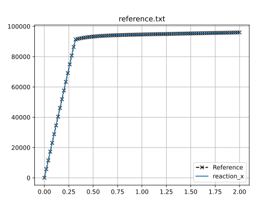

# Fitting example - Abaqus solver

A fitting example is included to demonstrate how to use `piglot` with the `Abaqus` solver.

A 2D specimen under plane strain is subjected to a uniaxial constant displacement of 2 mm prescribed in 100 load increments with time-steps of 0.02 seconds.

The matrix material phase constitutive behavior is governed by the von Mises isotropic elasto-plastic constitutive model with isotropic hardening. 

A mesh with a single CPE4 element is considered for discretisation (the body dimensions are 200x50x5 mm). The mesh and boundary conditions can be seen as follows:


We want to find the values for the Young's modulus (`Young`), the yield stress (`S1`) and a second stress point (`S2`) that will define the linear hardening curve. The defined Poisson coefficient is 0.3 and the two strain values for the hardening curve 0 and 0.25, respectively.

The reference force-displacement response is computed using the following values for these parameters: `Young: 210`, `S1: 325` and `S2: 600`. The reference response is provided in the `examples/abaqus_solver_fitting/reference.txt` file.

We run 25 iterations using the `botorch` optimiser within the [curve fitting setting](../sample_curve_fitting/description.md).

The configuration file (`examples/abaqus_solver_fitting/config.yaml`) for this example is:
```yaml
iters: 25

optimiser: botorch


parameters:
  Young: [100, 100, 300]
  S1: [200, 200, 400]
  S2: [500, 500, 700]


objective:
  name: fitting
  solver:
    name: abaqus
    # path to the Abaqus executable
    abaqus_path: C:\SIMULIA\Commands\abaqus.bat

    cases:
      'sample.inp':
        job_name: Job-1 # optional field for this case
        step_name: Step-1 # optional field for this case
        instance_name: Part-1-1 # optional field for this case
        fields:
          'reaction_x':
            name: FieldsOutput
            set_name: RF_SET
            field: RF
            x_field: U
            direction: x
   
  references:
    'reference.txt':
      prediction: reaction_x
```
The field `abaqus_path` must indicate the path to the `Abaqus` executable. The input data file for running `Abaqus` is given in `examples/abaqus_solver_fitting/sample.inp`, where the notation `<Young>`, `<S1>` and `<S2>` indicates the parameters to optimise. For each function call, and before running the solver, these template parameters are substituted by their appropriate values in the `Abaqus` input data file.

Note that the `Abaqus` input file (`sample.inp`) only has one Job, Step and Instance, so, the fields `job_name`, `step_name` and `instance_name` are optional in the `config.yaml`.

To run this example, open a terminal inside the `piglot` repository, enter the `examples/abaqus_solver_fitting` directory and run piglot with the given configuration file
```bash
cd examples/abaqus_solver_fitting
piglot config.yaml
```
You should see an output similar to
```
BoTorch: 100%|███████████████████████████████████████████████████████| 25/25 [06:24<00:00, 15.38s/it, Loss: 1.0686e-06]
Completed 25 iterations in 6m24s
Best loss:  1.06857710e-06
Best parameters
- Young:   210.492621
-    S1:   325.048144
-    S2:   611.079583
```
Note that despite the fact that the optimal parameters are not exactly the same as the ones used to compute the reference response, the loss function value is very small, and the fitting is excellent as can be seen in the figures below.

To visualise the optimisation results, use the `piglot-plot` utility.
In the same directory, run (this may take a few seconds)
```bash
piglot-plot animation config.yaml
```
This generates an animation for all the function evaluations that have been made throughout the optimisation procedure for the two target objectives.
You can find the `.gif` file(s) inside the output directory, which should give something like (for the `minimum_value` target):


Now, try running
```bash
piglot-plot parameters config.yaml
```
This will plot the evaluated parameters during the optimisation procedure: 


To see the convergence history of the best loss function value, run
```bash
piglot-plot history config.yaml --best --log
```
which will generate:


To see the best-observed value for the optimisation problem, run
```bash
piglot-plot best config.yaml
```
which will generate:



## Fitting example - Abaqus solver with composite setting

This subsection aims to show the difference in the results obtained using the composite option. Convergence is more stable, a smaller loss is achieved and the parameters are closer to the reference solution.

We run 25 iterations using the `botorch` optimiser within the [composite setting](../sample_curve_fitting_composite/description.md).

The configuration file (`examples/abaqus_solver_fitting/config_composite.yaml`) for this example is:
```yaml
iters: 25

optimiser: botorch


parameters:
  Young: [100, 100, 300]
  S1: [200, 200, 400]
  S2: [500, 500, 700]


objective:
  name: fitting
  composite: True
  solver:
    name: abaqus
    # path to the Abaqus executable
    abaqus_path: C:\SIMULIA\Commands\abaqus.bat

    cases:
      'sample.inp':
        job_name: Job-1 # optional field for this case
        step_name: Step-1 # optional field for this case
        instance_name: Part-1-1 # optional field for this case
        fields:
          'reaction_x':
            name: FieldsOutput
            set_name: RF_SET
            field: RF
            x_field: U
            direction: x
   
  references:
    'reference.txt':
      prediction: reaction_x
```

The output is the following
```
BoTorch: 100%|███████████████████████████████████████████████████████| 25/25 [07:35<00:00, 18.24s/it, Loss: 3.4894e-10]
Completed 25 iterations in 7m35s
Best loss:  3.48943524e-10
Best parameters
- Young:   210.001758
-    S1:   324.987890
-    S2:   600.530661
```

The animation for all the function evaluations that have been made throughout the optimisation procedure are once again showed running
```bash
piglot-plot animation config_composite.yaml
```

And the output is:


