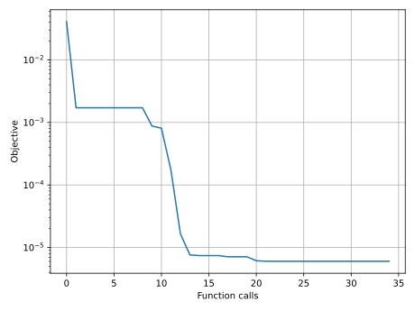

# Fitting example - crate solver

A fitting example is included to demonstrate how to use `piglot` with the clustering-based reduced-order model [`CRATE`](https://github.com/bessagroup/CRATE) solver.

A 2D plane-strain infinitesimal strains simulation of a 2-phase heterogeneous material characterized by randomly distributed circular particles (volume fraction = 30%) embedded in a matrix (volume fraction = 70%), is subjected to a uniaxial tension macro-scale strain monotonic loading path prescribed in 50 load increments, and given by

$
\boldsymbol{\varepsilon}=\begin{bmatrix}
0.02&0&0\\
0&0&0\\
0&0&0
\end{bmatrix}\,.
$

The matrix material phase constitutive behavior is governed by the von Mises isotropic elasto-plastic constitutive model with isotropic hardening, whereas the particle's material phase is governed by the isotropic linear elastic constitutive model.

A grid of $100\times 100$ voxels (provided in the `examples/crate_solver_fitting/Disk_50_0.3_100_100.rgmsh.npy` file) is considered for discretisation, with 8 clusters attributed to the matrix phase and 2 to the particles:


We want to find the values for the Young modulus and the Poisson coefficient of both phases.
The notation `Young_1` and `poisson_1` is respective to the properties of the matrix, and `Young_2` and `poisson_2` of the particles.

The reference equivalent stress-strain response is computed using the following values for these parameters: `Young_1: 100`, `poisson_1: 0.3`, `Young_2: 500` and `poisson_2: 0.19`.
The reference response is provided in the `examples/crate_solver_fitting/reference.hres` file.

We run 25 iterations using the `botorch` optimiser within the [composite setting](../sample_curve_fitting_composite/description.md).

The configuration file (`examples/crate_solver_fitting/config.yaml`) for this example is:
```yaml
iters: 25

optimiser: botorch

parameters:
  Young_1:   [200,   50,  350]
  poisson_1: [0.3,  0.2,  0.4]
  Young_2:   [400,  200,  600]
  poisson_2: [0.2,  0.1,  0.3]

objective:
  name: fitting
  composite: True
  solver:
    name: crate
    crate: path_to_CRATE/src/cratepy/main.py
    cases:
      'predicted.dat':
        fields:
          'equivalent_stress_strain':
            name: hresFile
            y_field: vm_stress
            x_field: vm_strain
  references:
    'reference.hres':
      prediction: ['equivalent_stress_strain']
      x_col: 25
      y_col: 26
      skip_header: 1
      filter_tol: 1e-6
      show: False
```
The input data file for running `CRATE` is given in `examples/crate_solver_fitting/predicted.dat`, where the notation `<Young_1>`, `<poisson_1>`, `<Young_2>` and `<poisson_2>` indicates the parameters to optimise.

The column 25 and 26, corresponding to the equivalent strain and equivalent stress, of the reference file are used for comparison, and the header of the reference file is ignored by setting `skip_header: 1`. The number of points in the reference response is also filtered using the [response reduction algorithm](../reference_reduction_composite/description.md) with a threshold of `filter_tol: 1e-6`.

To run this example, open a terminal inside the `piglot` repository, enter the `examples/crate_solver_fitting` directory and run piglot with the given configuration file
```bash
cd examples/crate_solver_fitting
piglot config.yaml
```
You should see an output similar to
```
Filtering reference reference.hres ... done (from 51 to 10 points, error = 4.50e-07)
BoTorch: 100%|█████████████████████████████████████████| 25/25 [02:15<00:00,  5.43s/it, Loss: 6.0299e-06]
Completed 25 iterations in 2m15s
Best loss:  6.02994207e-06
Best parameters
-   Young_1:   102.005847
- poisson_1:     0.288350
-   Young_2:   407.237665
- poisson_2:     0.165656
```
The number of points in the reference response was filtered from 51 to 10 points.
Note that despite the fact that the optimal parameters are not exactly the same as the ones used to compute the reference response, the loss function value is very small, and the fitting is excellent as can be seen in the figures below.

To visualise the optimisation results, use the `piglot-plot` utility.
In the same directory, run (this may take some time)
```bash
piglot-plot animation config.yaml
```
This generates an animation for all the function evaluations that have been made throughout the optimisation procedure for the two target objectives.
You can find the `.gif` file(s) inside the output directory, which should give something like (for the `minimum_value` target):


Now, try running
```bash
piglot-plot parameters config.yaml
```
This will plot the evaluated parameters during the optimisation procedure: 


To see the convergence history of the best loss function value, run
```bash
piglot-plot history config.yaml --best --log
```
which will generate:



To see the best-observed value for the optimisation problem, run
```bash
piglot-plot best config.yaml --best
```
which will generate:


