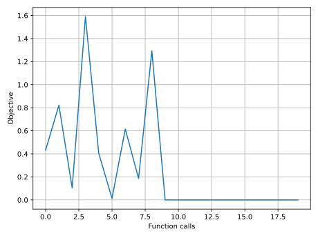
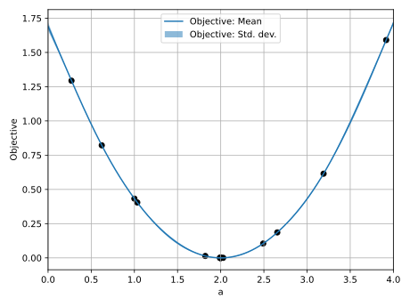

# Post-processing results

When solving a problem with a YAML configuration file, like the one in the [simple curve fitting example](../sample_curve_fitting/description.md), `piglot` stores most of the data collected during the optimisation in the output directory.
In this example, we will walk over the structure of the output data and, particularly, on using our `piglot-plot` utility for handling the post-processing and visualisation.
We build on top of the [simple curve fitting example](../sample_curve_fitting/description.md) and we assume in this tutorial that the optimisation problem has already been solved with
```bash
piglot config.yaml
```
which produces the `config` output directory.


## Output directory

When running `piglot config.yaml`, the following directory structure will be produced:
```
config
├── cases
│   └── case_1
├── cases_hist
│   ├── case_1-066c8026ba74b70857f3ab68b24a4c1200e3eecf472745a3172372e57a087d79
│   ├── case_1-156da358cdfe9167d0eed7b536182d94fe76ee8572e98e1008b559850a26d94a
|   |   ...
│   └── case_1-f096b92e4c546d96828afd012c148cbb70a80c93005ee4cf08e7c31d8e2e30a0
├── config
├── func_calls
├── history
├── progress
└── tmp
    ├── case_1.dat
    ├── case_1.out
    └── case_1.tmp
config.yaml
reference_curve.txt
```
Inside the `config` directory, three directories (`cases`, `cases_hist` and `tmp`) and four files (`config`, `func_calls`, `history` and `progress`) have been created.
Each of the files has the following data:
- `config/config` is simply a copy of the parsed YAML input file, used to verify that the input reading is correct and to store the exact configuration of the optimisation case;
- `config/func_calls` contains tabular data for each function evaluation, namely the start and objective evaluation run times, the objective value (and possibly its variance in [stochastic optimisation](../sample_curve_fitting_stochastic/description.md)), the parameter values and the parameter hash.
  The hash is computed with SHA256 on the binary representation of the parameters and serves as the unique identifier of the case.
  An example of this file is:
  ```
    Start Time /s	    Run Time /s	      Objective	              a	                                                            Hash
   1.33138150e-03	 1.10529615e-02	 4.32774678e-01	       1.000000	e1c54f41b449d2997ce426b22b0e24103c258a4e35632dcce8da80d964140bd8
   2.12348597e-02	 7.60192145e-03	 8.22040327e-01	       0.621861	e440d899a5137f4cf4559e98a15418b8e9c783be1b1ce8549f3e513cc06a816a
   2.88948463e-02	 7.28006847e-03	 1.04827989e-01	       2.491877	64d50061013020fdda2cbe15f29510bd9a0cc952726bb577db71179a639c4359
   3.62300798e-02	 7.32552260e-03	 1.59057447e+00	       3.916550	4a3b2ea1387fac34c7ae1a113cf680eac6ea483c8819da33d5ad53db26b2dd3f
   4.36127670e-02	 7.15153851e-03	 4.04572983e-01	       1.033125	bfa9fb1b7f2f2e46549ca9bd8c00bee8369e57201a70cbdbd272406cb9bd58c9
   5.08190878e-02	 6.92950096e-03	 1.38579282e-02	       1.820899	5a50cd302ecd881a9fe5fb6b75f5315780d2d063748693ff2b0d223aea163ae1
   5.78034185e-02	 6.93223719e-03	 6.14725627e-01	       3.191400	743b10cb79270796d1257cfbd2790a8dc2dba58b3b724af594dba0554af76a8a
   6.47911960e-02	 6.96630497e-03	 1.85929433e-01	       2.655140	e06c98e2c78a8060f39e4a985d319a795bab33fed3e813943e66a04520131ca5
   7.18131037e-02	 7.37586711e-03	 1.29362886e+00	       0.271223	558646b8dc5461f6b281b4e3336b349f47562de6e7b3ddb579043e4049956a5d
   1.55260443e-01	 7.46414158e-03	 3.49250006e-04	       2.028210	066c8026ba74b70857f3ab68b24a4c1200e3eecf472745a3172372e57a087d79
   2.17729615e-01	 7.42269773e-03	 4.25757091e-05	       1.989898	18f5ae1177be68cc81299aa662b506821344ced4f3396355fa570ea63aa5987e
   2.75472510e-01	 7.74521008e-03	 6.95113232e-06	       1.995817	89063be67f17669741457fa47cc309d6e5756df7fa73a7bc2bd6eee613b1e2e6
   3.41308642e-01	 7.44824484e-03	 2.94318115e-06	       1.997224	f096b92e4c546d96828afd012c148cbb70a80c93005ee4cf08e7c31d8e2e30a0
   4.01463990e-01	 7.41017610e-03	 1.49937159e-06	       1.997979	156da358cdfe9167d0eed7b536182d94fe76ee8572e98e1008b559850a26d94a
   4.66411451e-01	 7.32037798e-03	 8.20857293e-07	       1.998474	a3d376de6278aa1e6d019c175f2c4d5ffd070b4d2e204d4ca89e668762f6cbf6
   5.24713887e-01	 7.32501689e-03	 4.66078274e-07	       1.998828	286599a2654d85546fd63f4b7d925af115efa79d82580b37f4dbd87b78e3f3e0
   5.86219998e-01	 7.30782188e-03	 2.66617453e-07	       1.999101	7e4636a7d91d78c393d275817a68bd9db42d69422ddccaeb8193aba3ddd6edb4
   6.47620498e-01	 7.25860335e-03	 1.58313839e-07	       1.999308	8e08929703614049939b6675010133434f1f2f1e29a81ba491ed3918fc80c553
   7.10637731e-01	 7.34227244e-03	 8.78221084e-08	       1.999511	c2f486822162d031552982db6f90bce285b68d55ae77027488c4dda8ceb724bc
   7.18561349e-01	 7.02789798e-03	 8.78221084e-08	       1.999511	c2f486822162d031552982db6f90bce285b68d55ae77027488c4dda8ceb724bc
  ```
- `config/history` contains *optimiser* history reports.
  The number of iterations and lines in this file matches the number of iterations in the configuration file and the progress bar.
  It is similar to the `config/func_calls` file, but also shows the current best objective and, if supported, additional information the optimiser may report.
  An example is:
  ```
  Iteration         Time /s       Best Loss    Current Loss               a  Optimiser info
          0  7.87045425e-02  1.38579282e-02  1.38579282e-02      1.82089937  -
          1  1.61725894e-01  3.49250006e-04  3.49250006e-04      2.02820977  -
          2  2.24110493e-01  4.25757091e-05  4.25757091e-05      1.98989845  -
          3  2.82389528e-01  6.95113232e-06  6.95113232e-06      1.99581669  -
          4  3.47688564e-01  2.94318115e-06  2.94318115e-06      1.99722401  -
          5  4.07869948e-01  1.49937159e-06  1.49937159e-06      1.99797928  -
          6  4.72661112e-01  8.20857293e-07  8.20857293e-07      1.99847444  -
          7  5.31035105e-01  4.66078274e-07  4.66078274e-07      1.99882824  -
          8  5.92451273e-01  2.66617453e-07  2.66617453e-07      1.99910091  -
          9  6.53873641e-01  1.58313839e-07  1.58313839e-07      1.99930760  -
         10  7.16907239e-01  8.78221084e-08  8.78221084e-08      1.99951109  -
  ```
- `config/progress` contains the current iteration number, number of function calls, best objective value and respective parameters, along with the total elapsed time.
  Useful for tracking the progress in a remote running problem.
  As an example:
  ```
  Iteration: 10
  Function calls: 19
  Best loss: 8.78221084301375e-08
  Best parameters:
    a: 1.9995110863655545

  Elapsed time: 0.71691s
  ```

On the other hand, the directories are the following:
- `config/cases/` contains a file for each output field of the problem.
  In our example, we only registered the field `case_1`, so we only have a file with the same name in this directory.
  This has a similar structure to the `config/func_calls` file but additionally contains success info for each call, which may be particularly useful when running multiple cases that may, for some combination of parameters, fail.
- `config/cases_hist/` stores the relevant information for a given function call of a solver case.
  Each file in this folder has the format `<case_name>-<hash>`.
  In addition to the usual timing and parameter metadata, it also contains all the responses for this case.
  Having this information is particularly useful to check whether the response `piglot` is receiving from a solver is correct.
- `config/tmp/` holds the temporary files used by a solver during the optimisation.
  Also, since `piglot` re-runs the best-observed parameters at the end of the optimisation by default, it will contain the solver data for this case at the end.


## The `piglot-plot` utility

To ease post-processing, you can visualise most of the optimisation results using our `piglot-plot` utility.
With this tool, you can plot results for:
- response for a given case;
- response for best-observed objective;
- currently running response (only supported by some solvers);
- objective history;
- parameter history;
- cumulative regret;
- animation with the evaluated responses;
- Gaussian process regression for 1D optimisation problems.

We will now provide a set of examples for each of these scenarios.
For all these examples, it is assumed that the problem has already been solved using the configuration file.
For additional details on the commands, you can also use
```bash
piglot-plot --help
```
In general, the tool relies on the syntax
```bash
piglot-plot command config.yaml [options]
```
where the `command` determines the mode of operation.
Additionally, specific help for each command can be obtained with `piglot-plot command --help`.


### Case plotting

To view the responses of an individual function call, you can use the `case` command.
This requires passing the hash of the call to observe.
For instance, to visualise the initial shot of the optimisation, which corresponds to the hash `e1c54f41b449d2997ce426b22b0e24103c258a4e35632dcce8da80d964140bd8`, one can use
```bash
piglot-plot case config.yaml e1c54f41b449d2997ce426b22b0e24103c258a4e35632dcce8da80d964140bd8
```


In addition, you can save the figure (without graphical output) to the `case.png` file using the option `--save_fig`:
```bash
piglot-plot case config.yaml e1c54f41b449d2997ce426b22b0e24103c258a4e35632dcce8da80d964140bd8 --save_fig case.png
```
If the optimisation requires evaluating more than one response, each plot is saved and the file names are automatically updated to, for example, `case_0.png` and `case_1.png`.
This option is supported by most plotting utilities, as shown below.


### Best-observed objective

To plot the best-observed objective, run
```bash
piglot-plot best config.yaml
```


which also outputs the following to the terminal:
```
Best run:
Start Time /s    0.710638
Run Time /s      0.007342
a                1.999511
Name: 18, dtype: object
Hash: c2f486822162d031552982db6f90bce285b68d55ae77027488c4dda8ceb724bc
Objective:  8.78221084e-08
```
This command is equivalent to manually finding the best-observed call in the `func_calls` file and using `piglot-plot case` on it.
In addition, this also supports the `--save_fig` option.


### Currently running call

For supported solvers and objectives, to plot the currently running case use
```bash
piglot-plot current config.yaml
```


which dynamically updates the plot every second with the most recent data.
The update rate can be controlled with the `--rate <time>` option, where the time is passed in seconds.
This mode does not support saving the figure to a file.


### Objective history

The objective history can be plotted using
```bash
piglot-plot history config.yaml
```


This simply shows each objective value for each function call.
Alternatively, we can also plot the best-observed objective value with
```bash
piglot-plot history config.yaml --best
```


And, since our objective is non-negative, we can also plot in a logarithmic scale:
```bash
piglot-plot history config.yaml --best --log
```


Finally, it may be worthwhile to plot the objective with respect to the elapsed time, by using
```bash
piglot-plot history config.yaml --best --log --time
```


The options `--best`, `--log` and `--time` can be used independently.
Also, saving the figure with `--save_fig` is supported.


### Parameter history

Similarly, with the objective history, we can also plot the parameter history using
```bash
piglot-plot parameters config.yaml
```


which plots the evolution of each parameter w.r.t. the function calls.
A separate plot is created for each parameter.
In addition, the options `--best`, `--log`, `--time` and `--save_fig` are supported, which similar behaviour as in the objective history.


### Cumulative regret

A common quantity used to benchmark global optimisation methods is cumulative regret.
You can plot it using
```bash
piglot-plot regret config.yaml
```


This also supports the `--log`, `--time` and `--save_fig` options.


### Response animation

If you wish to see the responses that have been evaluated throughout the optimisation, you can build an animation using
```bash
piglot-plot animation config.yaml
```
which creates a GIF file for each objective inside the output directory.
For this example, this file leads to the file `config/Objective-0.gif` with the following animation:


Unlike other commands, this does not support any additional options.


### Gaussian process regression

When optimising a single parameter, we also support plotting a Gaussian process (GP) regression over the data generated by the optimiser.
This plots the observed points and the surrogate model for the objective-parameter relation, given by
```bash
piglot-plot gp config.yaml
```


In addition, we can plot the GP up to a given number of function calls using
```bash
piglot-plot gp config.yaml --max_calls 6
```


which only considers the first 6 function calls to build the surrogate model.
Additionally, the `--save_fig` option is also supported.

