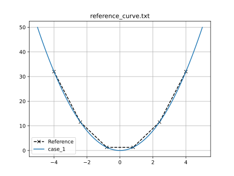
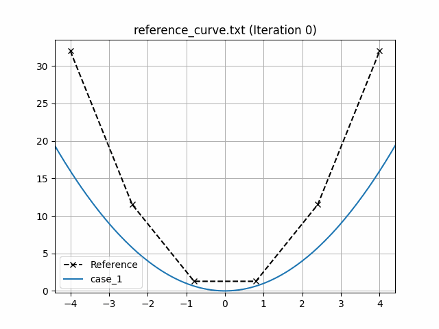

# Analytical curve

A simple analytical curve fitting problem is included to demonstrate how to use `piglot`.
In this case, we aim to fit a quadratic expression of the type $f(x) = a x^2$, using as a reference, a numerically generated reference from the expression $f(x) = 2 x^2$ (provided in the `examples/sample_curve_fitting/reference_curve.txt` file).
We want to find the value for $a$ that better fits our reference (it should be 2).

We run 10 iterations using the `botorch` optimiser (our interface for Bayesian optimisation), and set the parameter `a` for optimisation with bounds `[0,4]` and initial value 1.
Our optimisation objective is the fitting of an analytical curve, with the expression `<a> * x ** 2`.
The notation `<a>` indicates that this parameter should be optimised.
We also define a parameterisation using the variable $x$, where we sample the function between `[-5,5]` with 100 points.

## Using configuration files
The configuration file (`examples/sample_curve_fitting/config.yaml`) for this example is:
```yaml
iters: 10

optimiser: botorch

parameters:
  a: [1, 0, 4]

objective:
  name: fitting
  solver:
    name: curve
    cases:
      'case_1':
        expression: <a> * x ** 2
        parametric: x
        bounds: [-5, 5]
        points: 100
  references:
    'reference_curve.txt':
      prediction: ['case_1']
```
The generated response with the label `case_1` is compared with our reference response, given from the file `reference_curve.txt`

To run this example, open a terminal inside the `piglot` repository, enter the `examples/sample_curve_fitting` directory and run `piglot` with the given configuration file
```bash
cd examples/sample_curve_fitting
piglot config.yaml
```
You should see an output similar to
```
BoTorch: 100%|██████████████████████████████| 10/10 [00:00<00:00, 17.66it/s, Loss: 8.8505e-08]
Completed 10 iterations in 0.56614s
Best loss:  8.85050592e-08
Best parameters
- a:     1.999508
```
As you can see, `piglot` correctly identifies the `a` parameter close to the expected value of 2, and the error of the fitting is in the order of $10^{-8}$.
In addition to these outputs, `piglot` creates an output directory, with the same name as the configuration file (minus the extension), where it stores the optimisation data.

To visualise the optimisation results, use the `piglot-plot` utility.
A detailed description of this tool is shown in the [post-processing example](../post_processing/description.md).
In the same directory, run
```bash
piglot-plot best config.yaml
```
Which will display the best-observed value for the optimisation problem.
You should see the following output in the terminal
```
Best run:
Start Time /s    0.587397
Run Time /s      0.004439
a                1.999508
Name: 18, dtype: object
Hash: 2313718f75bc0445aa71df7d6d4e50ba82ad593d65f3762efdcbed01af338e30
Objective:  8.85050592e-08
```
The script will also plot the best-observed response, and its comparison with the reference response:



Now, try running (this may take some time)
```bash
piglot-plot animation config.yaml
```
This generates an animation for all the function evaluations that have been made throughout the optimisation procedure.
You can find the `.gif` file(s) inside the output directory, which should give something like:




## Using Python scripts

Another way of using `piglot` is via its package and Python modules.
This approach may offer increased flexibility in the setup of the optimisation problem, at the cost of increased complexity and verbosity.
A sample script equivalent to the configuration file for the problem described in [the previous section](#using-configuration-files) is provided in `examples/sample_curve_fitting/config.py`, given by:
```python
import os
import shutil
from piglot.parameter import ParameterSet
from piglot.solver.solver import Case
from piglot.solver.curve.solver import CurveSolver
from piglot.solver.curve.fields import CurveInputData, Curve
from piglot.objectives.fitting import Reference, MSE
from piglot.objectives.fitting import FittingObjective, FittingSolver
from piglot.optimisers.botorch.bayes import BayesianBoTorch

# Set up output and temporary directories
output_dir = 'config'
tmp_dir = os.path.join(output_dir, 'tmp')
if os.path.isdir(output_dir):
    shutil.rmtree(output_dir)
os.makedirs(output_dir, exist_ok=True)

# Set up optimisation parameters
parameters = ParameterSet()
parameters.add('a', 1.0, 0.0, 4.0)

# Set up the reference
reference = Reference('reference_curve.txt', ['case_1'], output_dir)

# Set up the solver to use
input_data = CurveInputData('case_1', '<a> * x ** 2', 'x', (-5.0, 5.0), 100)
case_1 = Case(input_data, {'case_1': Curve()})
solver = CurveSolver([case_1], parameters, output_dir, tmp_dir=tmp_dir)

# Set up the fitting objective
references = {reference: ['case_1']}
fitting_solver = FittingSolver(solver, references)
objective = FittingObjective(parameters, fitting_solver, output_dir, MSE())

# Set up the optimiser and run optimisation
optimiser = BayesianBoTorch(objective)
value, params = optimiser.optimise(10, parameters, output_dir)
print(f"Optimal value: {value}")
print(f"Optimal parameters: {params}")
```
Run with
```bash
python config.py
```
Example output
```
BoTorch: 100%|█████████████████████████████| 10/10 [00:00<00:00, 16.75it/s, Loss: 8.9167e-08]
Completed 10 iterations in 0.59692s
Best loss:  8.91673999e-08
Best parameters
- a:     1.999506
Optimal value: 8.916739991036405e-08
Optimal parameters: [1.99950592]
```
