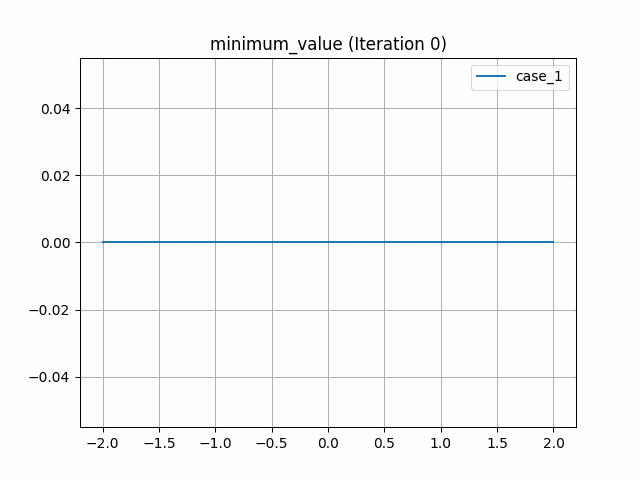
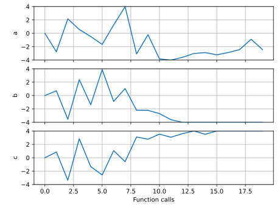
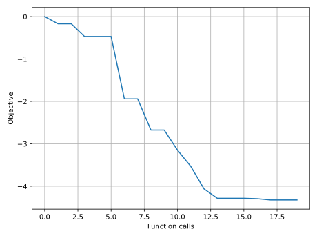

# Design example - analytical curve

A simple design objective example is included to demonstrate how to use `piglot` in this context.
In design problems, there is no reference response available, and several values of the parameters have to be evaluated for the target objectives.

In this problem, we aim to minimise the minimum value and maximimise the area below a nonlinear function given by the expression $f(x) = |a \exp(x) + bx^2+c\sin(x)|$.


We run 10 iterations using the `botorch` optimiser, and set the parameters for optimisation (`a`, `b` and `c`) with bounds `[-4,4]` and initial value 0.
The notation `<a>`, `<b>` and `<c>` indicates that these parameters should be optimised.
We also define a parameterisation using the variable $x$, where we sample the function between `[-2,2]` with 100 points.

The configuration file (`examples/sample_curve_design/config.yaml`) for this example is:
```yaml
iters: 10

optimiser: botorch

parameters:
  a: [0, -4, 4]
  b: [0, -4, 4]
  c: [0, -4, 4]

objective:
  name: design
  solver:
    name: curve
    cases:
      'case_1':
        expression: abs(<a> * exp(x) + <b> * x**2 + <c> * sin(x))
        parametric: x
        bounds: [-2, 2]
        points: 100
  targets:
    'minimum_value':
      quantity: max
      prediction: ['case_1']
      negate: False
    'maximum_area':
      quantity: integral
      prediction: ['case_1']
      negate: True
```
The generated response with the label `case_1` is optimised having two target objectives: (i) minimisation of the minimum function value `minimum_value`, and (ii) maximization of the area/integral below the function `maximum_area`.

To run this example, open a terminal inside the `piglot` repository, enter the `examples/sample_curve_design` directory and run piglot with the given configuration file
```bash
cd examples/sample_curve_design
piglot config.yaml
```
You should see an output similar to
```
BoTorch: 100%|███████████████████████████████████████| 10/10 [00:00<00:00, 10.92it/s, Loss: -4.3239e+00]
Completed 10 iterations in 0.91609s
Best loss: -4.32393814e+00
Best parameters
- a:    -2.433969
- b:    -4.000000
- c:     4.000000
```
To visualise the optimisation results, use the `piglot-plot` utility.
In the same directory, run (this may take some time)
```bash
piglot-plot animation config.yaml
```
This generates an animation for all the function evaluations that have been made throughout the optimisation procedure for the two target objectives.
You can find the `.gif` file(s) inside the output directory, which should give something like (for the `minimum_value` target):


Now, try running
```bash
piglot-plot parameters config.yaml
```
This will plot the evaluated parameters during the optimisation procedure: 


To see the convergence history of the best loss function value, run
```bash
piglot-plot history config.yaml --best
```
which will generate:
