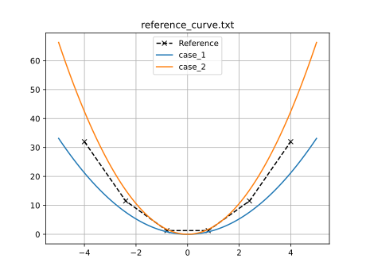
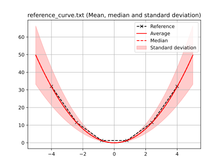
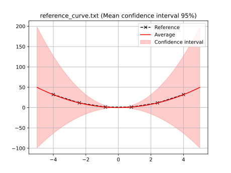

# Stochastic curve fitting example - composite setting

Following the [stochastic curve fitting example](../sample_curve_fitting_stochastic/description.md), we now show how to use stochastic curve fitting under function composition.
If you are unfamiliar with the stochastic aspect, please check the aforementioned example first.

As before, we start by defining the two analytical expressions used for describing the curve:

$
\begin{aligned}
&f_1(x) = a x^2 \\
&f_2(x) = 2a x^2
\end{aligned}
$

Once again, the goal is to build a stochastic objective function with a certain probability distribution and optimise it.
In the previous example, the objective function was assumed to follow a Gaussian distribution with known mean and variance, that is, $J(a) \sim \mathcal{N}\left(\mu(a),\sigma^2(a)\right)$.
These terms were computed from the individual loss functions of $f_1$ and $f_2$.

However, under composition, we instead assume that, for a fixed $a$, the *response* at every point $x$ of the curve follows a normal distribution with known mean $\mu(x)$ and variance $\sigma^2(x)$, that is, $f(x) \sim \mathcal{N}\left(\mu(x), \sigma^2(x)\right)$.
This is fundamentally different from the previous approach.
In the simple (non-composite) strategy, we assume the scalar *objective function* (or loss, in the curve fitting case) is Gaussian; in the composite fashion, it is the *response* that is Gaussian.
We can then compute the statistical quantities in a similar fashion:

$
\begin{aligned}
&\mu(x) = \dfrac{1}{N}\sum_{i=1}^{N} f_i(x) = \dfrac{f_1(x)+f_2(x)}{2} \\
&\sigma^2(x) = \dfrac{1}{N^2}\sum_{i=1}^{N} \left[f_i(x) - \mu(x)\right]^2 = \dfrac{\left[f_1(x)-\mu(x)\right]^2+\left[f_2(x)-\mu(x)\right]^2}{4}
\end{aligned}
$

With the statistical model for the response, it is now time to build the statistical model for the objective function, which is then passed to the optimiser.
This is where the composition aspect comes into play.
Using BoTorch, we never need to explicitly compute the posterior distribution of the objective function as most acquisition functions can be computed with quasi-Monte Carlo sampling.
Refer to the [composite curve fitting](../sample_curve_fitting_composite/description.md) example for more details on how we approach this problem.

In practice, to use composition, you only need to set the `composite: True` flag in the objective configuration.
The configuration file (`examples/sample_curve_fitting_stochastic_composite/config.yaml`) for this example is:
```yaml
iters: 10

optimiser: botorch

parameters:
  a: [1, 0, 4]

objective:
  name: fitting
  stochastic: True
  composite: True
  solver:
    name: curve
    cases:
      'case_1':
        expression: <a> * x ** 2
        parametric: x
        bounds: [-5, 5]
        points: 100
      'case_2':
        expression: 2* <a> * x ** 2
        parametric: x
        bounds: [-5, 5]
        points: 100
  references:
    'reference_curve.txt':
      prediction: ['case_1', 'case_2']
```
Example output for this case:
```
BoTorch: 100%|████████████████████████████████████████| 10/10 [00:02<00:00,  3.80it/s, Loss: 5.2804e-05]
Completed 10 iterations in 2s
Best loss:  5.28041030e-05
Best parameters
- a:     1.325847
```
Piglot identifies the `a` parameter as 1.326, and the error of the fitting is in the order of $10^{-6}$.
Unlike the non-composite case, the fitting error is significantly smaller.
Recall that, this time, we are optimising the mean response of the two functions, which gives a theoretical value of $a=4/3\approx 1.333$ for the optimum.
Finally, plotting the best case with `piglot-plot` yields:
```
Best run:
Start Time /s    2.595121
Run Time /s      0.014108
Variance         0.018073
a                1.325847
Name: 18, dtype: object
Hash: fc36fad0fc55278da3c16dbfd9a257e42c2d81361e8650236013ab6f6426c104
Objective:  5.28041030e-05
```



