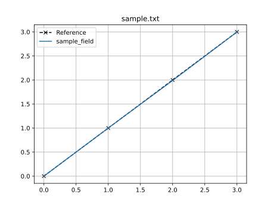

Adding support for new solvers
==============================

If you wish to use ``piglot`` with a new solver, there is some programming required.
In this guide, we provide the main steps and building blocks needed to connect ``piglot`` to your solver.
Additionally, we strongly encourage developers to contribute their solver interfaces to this project according to our `guidelines <https://github.com/CM2S/piglot/blob/main/CONTRIBUTING.md>`__.

What is a solver for ``piglot``?
--------------------------------

At its core, a solver can be seen as a function that, for a given set of parameters, returns a set of discrete responses.
While this is an overly simplistic view of the job of an interface, from an optimisation perspective, this is exactly the behaviour we are expecting.
In a more realistic scope, we can highlight the following aspects:

- The **solver** to use and its options must be completely defined;
- For a given optimisation problem, our objective function may be dependent on a set of different **cases**.
  Each case requires a simulation or numerical analysis from the solver.
- Each case has some **input data** that, in conjunction with the parameters to optimise, fully define the numerical problem.
- From each case, we may be interested in extracting some **output fields** of interest, from which we can build our **output responses** that are returned to ``piglot``.

The highlighted terms refer to the building blocks of a solver
interface. Furthermore, we can specify the following hierarchy:

::

   solver
   ├── options
   └── cases
       ├── case_1
       |   ├── input data
       |   └── output fields
       |       ├── field_1
       |       └── field_2
       └── case_2
           ├── input data
           └── output fields
               └── field_3

For a given solver, all these ingredients must be properly defined. This
can be accomplished by extending a set of generic classes.

Implementing an interface
-------------------------

The base classes for a solver can be found in the module
``piglot.solver.solver``. To construct the interface, we derive from
these classes and implement the following methods for each:

* ``InputData`` - contains the required input data to generate the numerical problem for the solver.
  Requires the following methods:

   * ``prepare()`` - receives the parameter values to evaluate, and should prepare and return an instance with the input data prepared for the simulation.

   * ``name()`` - return the name of the input data.
     Used for naming the cases.

   * ``check()`` - *optional* method that receives the set of parameters to optimise for and checks if the input data is valid.

* ``OutputField`` - specifies the output field to read from the solver.
  Requires the following methods:

   * ``check()`` - receives the input data and checks if the output field is valid and consistent with it.

   * ``get()`` - receives the input data and returns the output result for the field of interest.
     This is the main method for reading from the output of the numerical solver.

   * ``read()`` - receives the configuration dictionary (from the YAML file) and returns the instance of the output field.
     Used for parsing the YAML file into a class instance.

* ``Solver`` - contains all the data for the solver and its cases.
  When deriving from this class, do not forget to call the base class' constructor to set some internal variables.
  Requires the following methods:

   * ``_solve()`` - receives the current parameter values to evaluate the responses for and returns a mapping between a ``Case`` and its ``CaseResult``.
     This is the main function of the solver interface, which is called once for each function evaluation.
     This method is expected to run the solver for all the cases and read all their output fields.

   * ``get_current_response()`` - returns the mapping between the output field and the output result.
     This is needed for the current case plotting with ``piglot-plot``.

   * ``read()`` - receives the configuration dictionary, the parameter set and the output directory, and returns a ``Solver`` instance.
     This is required to parse the YAML file into a class instance.

Example
-------

To showcase the implementation of a solver interface, we provide an example of a solver interface for a simple solver that simply returns a response with each input parameter.
Note that this is an extremely simplistic example; in practice the solver would be a numerical simulation or a numerical optimisation algorithm, which requires significantly more complex code.

.. literalinclude:: ../../../examples/solver_example/solver.py
  :language: python

With this solver interface, we then need to add the new class to our list of supported solvers.
This requires adding the solver to the ``AVAILABLE_SOLVERS`` dictionary in the package ``piglot.solver``.
In this example, we add the solver to the dictionary with the name ``sample``.

Then, consider the following input file:

.. literalinclude:: ../../../examples/solver_example/config.yaml
  :language: yaml

Where the reference curve in the file ``sample.txt`` is:

.. literalinclude:: ../../../examples/solver_example/sample.txt
  :language: text

Running this example you will get the following output:

.. code-block::

    BoTorch: 100%|████████████████| 64/64 [00:04<00:00, 14.39it/s, Loss: 1.4762e-05]
    Completed 64 iterations in 4s
    Best loss:  1.47622744e-05
    Best parameters
    - a:     0.000000
    - b:     1.000857
    - c:     1.988631
    - d:     2.998306

Finally, using the ``piglot-plot`` command, you can plot the results:

.. code-block::

    piglot-plot best config.yaml

Note that this example is merely illustrative of the process of implementing a solver interface.
For additional examples of solver interfaces, refer to the existing implementations in ``piglot``.
