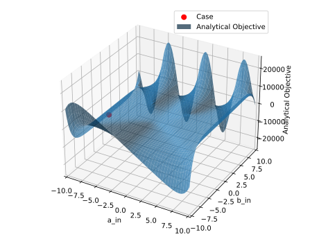
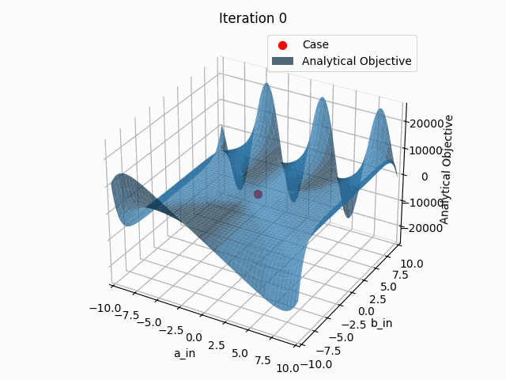

## output_parameters example

A simple analytical example is included to demonstrate how to use `piglot` to find the minimum value of an analytical expression using the `output_parameters` functionality.
In this case, we aim to find the parameters `a` and `b` that minimise an analytical expression given by $f(x) = \sinh(a) + b\sin(a) - a/b$. The parameter `a` has bounds `[-10,0]` and the parameter `b` has bounds `[1,25000]`. Given the wide bounds of the parameter `b` it is convenient to optimise this parameter in a logarithmic scale. 
Within this setting, the parameter `b` is expressed in terms of a new parameter `b_in`, such that ```b: exp(b_in)```. The parameter `b_in` is the one used for optimisation and has bounds given by `[0,10]` (the upper bound is round off for simplicity). 
 

We run 10 iterations using the `botorch` optimiser (our interface for Bayesian optimisation).

The configuration file (`examples/output_parameters/config.yaml`) for this example is:
```yaml
iters: 10

optimiser: botorch


parameters:
  a_in: [-5,-10, 0]
  b_in: [5,  0, 10]

output_parameters:
  a: a_in
  b: exp(b_in)

objective:
  name: analytical
  expression: sinh(a) + b * sin(a) - a/b
```
Note that all parameters in `parameters` have to be defined in `output_parameters`.


To run this example, open a terminal inside the `piglot` repository, enter the `examples/output_parameters` directory and run piglot with the given configuration file
```bash
cd examples/output_parameters
piglot config.yaml
```
You should see an output similar to
```
BoTorch: 100%|███████████████████████████████████████| 10/10 [00:00<00:00, 12.47it/s, Loss: -2.3354e+04]
Completed 10 iterations in 0.80208s
Best loss: -2.33544803e+04
Best parameters
- a_in:    -7.918022
- b_in:    10.000000
```
As shown below, this solution is the optimal solution for the function under analysis. 

To visualise the optimisation results, use the `piglot-plot` utility.
In the same directory, run
```bash
piglot-plot best config.yaml
```
Which will display the best observed value for the optimisation problem.
You should see the following output in the terminal
```
Best run:
Start Time /s    0.444681
Run Time /s       0.00003
a_in            -7.918022
b_in                 10.0
Name: 14, dtype: object
Hash: 71f2861f23499f09cec45132333db6a83697bd061314cf1b863a1789cc466123
Objective: -2.33544803e+04
```
The script will also plot the best observed response, and its comparison with the reference response: 


Now, try running (this may take some time)
```bash
piglot-plot animation config.yaml
```
This generates an animation for all the function evaluations that have been made throughout the optimisation procedure.
You can find the `.gif` file(s) inside the output directory, which should give something like:


