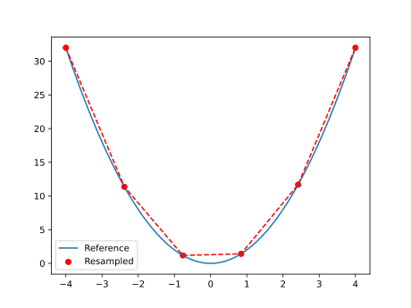

## reference_reduction_composite example

A simple analytical curve fitting problem is included to demonstrate how to use `piglot` with a modified reference response.
In this case, we aim to demonstrate how the composite Bayesian optimisation is sensitive to the number of sampling points in the reference response, and present a strategy to mitigate this effect.

The quadratic expression to fit is of the type $f(x) = a x^2$, and has as reference response a numerically generated response from the expression $f(x) = 2 x^2$ (provided in the `examples/reference_reduction_composite/reference_curve.txt` file).
We want to find the value for $a$ that better fits our reference (it should be 2).

We run 10 iterations using the `botorch` optimiser (our interface for Bayesian optimisation), and set the parameter `a` for optimisation with bounds `[0,4]` and initial value 1.
Our optimisation objective is the fitting of an analytical curve, with the expression `<a> * x ** 2`.
The notation `<a>` indicates that this parameter should be optimised.
We also define a parameterisation using the variable $x$, where we sample the function between `[-5,5]` with 100 points.


For this example, we consider a reference response with 100 sampling points.
As you will see, the computational cost of the composite Bayesian optimisation is quite dependent on this number.


### Original reference response
The configuration file (`examples/reference_reduction_composite/config.yaml`) for this example is:
```yaml
iters: 10

optimiser: botorch

parameters:
  a: [1, 0, 4]

objective:
  name: fitting
  composite: True
  solver:
    name: curve
    cases:
      'case_1':
        expression: <a> * x ** 2
        parametric: x
        bounds: [-5, 5]
        points: 100
  references:
    'reference_curve.txt':
      prediction: ['case_1']
```
Note that the only difference between this example and the one in `examples/sample_curve_fitting_composite` is that the reference response `reference_curve.txt` contains 100 points and not 6 points.

To run this example, open a terminal inside the `piglot` repository, enter the `examples/reference_reduction_composite` directory and run piglot with the given configuration file
```bash
cd examples/reference_reduction_composite
piglot config.yaml
```
You should see an output similar to
```
BoTorch: 100%|████████████████████████████████████████| 10/10 [00:25<00:00,  2.52s/it, Loss: 6.1178e-08]
Completed 10 iterations in 25s
Best loss:  6.11782174e-08
Best parameters
- a:     1.999625
```
As you can see, piglot correctly identifies the `a` parameter close to the expected value of 2 but takes approximately 25s to complete the optimisation. Moreover, memory usage has a peak value of 1.17GB.

Now, we will apply a reference reduction algorithm to reduce the number of points in the reference response and see how it affects the computational cost of the composite strategy.

### Reduced reference response
To perform the filtering of the data, the two-stage algorithm proposed in [Coelho et al.]([docs/source/simple_example/best.svg](https://dx.doi.org/10.2139/ssrn.4674421)) is used.
This algorithm includes two stages which are briefly described as follows:
1. Elimination stage: At every iteration, eliminate a single point from the reference response. For every point in the filtered response, we simulate its removal and compute the error between the original response and the filtered response. Then, the point that leads to the smallest error is eliminated. The procedure is repeated until we reach a predefined error threshold, or we run out of inner points to eliminate.

2. Refinement stage: Optimise the coordinates of the resulting points to minimise the interpolated error. The optimisation variables are the time coordinates of the inner points, which are free to move along the reference time grid. The default bounded optimisation method in `scipy.optimize.minimize` is used for this task. This step retains the same number of points given from the previous stage, but it may lead to a better distribution of the points along the reference time grid.

This feature can be activated by simply setting the filtering tolerance of the reference response to a given threshold. In this case we set `filter_tol: 1e-2`.

The configuration file (`examples/reference_reduction_composite/config_reduction.yaml`) for this example is:
```yaml
iters: 10

optimiser: botorch

parameters:
  a: [1, 0, 4]

objective:
  name: fitting
  composite: True
  solver:
    name: curve
    cases:
      'case_1':
        expression: <a> * x ** 2
        parametric: x
        bounds: [-5, 5]
        points: 100
  references:
    'reference_curve.txt':
      prediction: ['case_1']
      filter_tol: 1e-2
      show: False
```

To run this example, open a terminal inside the `piglot` repository, enter the `examples/reference_reduction_composite` directory and run piglot with the given configuration file
```bash
cd examples/reference_reduction_composite
piglot config_reduction.yaml
```
You should see an output similar to
```
Filtering reference reference_curve.txt ... done (from 100 to 6 points, error = 4.28e-03)
BoTorch: 100%|████████████████████████████████████████| 10/10 [00:01<00:00,  7.90it/s, Loss: 6.6555e-09]
Completed 10 iterations in 1s
Best loss:  6.65547123e-09
Best parameters
- a:     1.999832
```
As you can see, the information of the filtering output is provided, namely the number of points in the original and reduced responses and the expected error between the two responses. The reduced reference response after filtering is saved in a `filtered_references/reference_curve.txt` file inside the output directory. 
Moreover, it is observed that piglot still correctly identifies the `a` parameter close to the expected value of 2, but now it takes approximately 1s to perform the optimisation, with a peak memory usage value of 0.53GB.
In comparison with the previous example, the computational time is now 25 times faster, and the peak of the memory is more than 2 times smaller. Note that this effect becomes even more prominent if more iterations are considered.


The reduced reference response can also be seen before the optimisation procedure by setting `show: True`:


The differences between the original and reduced responses is compiled in the table:

|  | original response | reduced response |
|----------|----------|----------|
| number of points | 100 | 6 |
| computational time / s |  25 | 1 |
| memory peak / GB | 1.17 | 0.53 |
| optimal parameter `a` | 1.999625 | 1.999832 |

As described in `examples/input_data_file_template.yaml` more modifications of the reference response are readily available.