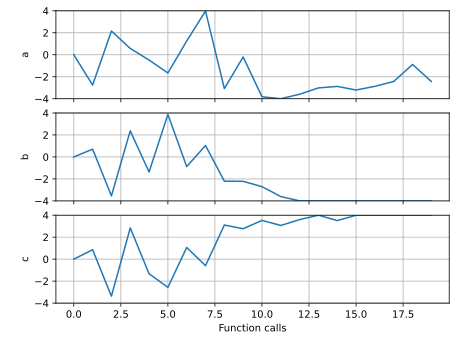
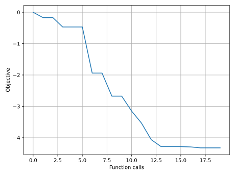

## sample_curve_design example

A simple design objective example is included to demonstrate how to use `piglot` in design problems.

In this problem, we aim to minimise the minimum value and maximimise the area below a nonlinear function given by the expression $f(x) = |a \exp(x) + bx^2+c\sin(x)|$.

In this case, there is no reference response, and several values of the parameters `a`, `b` and `c` are evaluated for the target objectives.

We run 10 iterations using the `botorch` optimiser (our interface for Bayesian optimisation), and set the parameters for optimisation (`a`, `b` and `c`) with bounds `[0,4]` and initial value 1.
The notation `<a>`, `<b>` and `<c>` indicates that these parameters should be optimised.
We also define a parameterisation using the variable $x$, where we sample the function between `[-2,2]` with 100 points.

The configuration file (`examples/sample_curve_design/config.yaml`) for this example is:
```yaml
iters: 10

optimiser: botorch

parameters:
  a: [0, -4, 4]
  b: [0, -4, 4]
  c: [0, -4, 4]

objective:
  name: design
  solver:
    name: curve
    cases:
      'case_1':
        expression: abs(<a> * exp(x) + <b> * x**2 + <c> * sin(x))
        parametric: x
        bounds: [-2, 2]
        points: 100
  targets:
    'minimum_value':
      quantity: max
      prediction: ['case_1']
      negate: False
    'maximum_area':
      quantity: integral
      prediction: ['case_1']
      negate: True
```
The generated response with the label `case_1` is optimised having two target objectives: (i) minimisation of the minimum function value `minimum_value`, and (ii) maximization of the area/integral below the function `maximum_area`.

To run this example, open a terminal inside the `piglot` repository, enter the `examples/sample_curve_design` directory and run piglot with the given configuration file
```bash
cd examples/sample_curve_design
piglot config.yaml
```
You should see an output similar to
```
BoTorch: 100%|███████████████████████████████████████| 10/10 [00:00<00:00, 10.92it/s, Loss: -4.3239e+00]
Completed 10 iterations in 0.91609s
Best loss: -4.32393814e+00
Best parameters
- a:    -2.433969
- b:    -4.000000
- c:     4.000000
```
In addition to these outputs, `piglot` creates an output directory, with the same name of the configuration file (minus the extension), where it stores the optimisation data.

To visualise the optimisation results, use the `piglot-plot` utility.
In the same directory, run (this may take some time)
```bash
piglot-plot animation config.yaml
```
This generates an animation for all the function evaluations that have been made throughout the optimisation procedure for the two target objectives.
You can find the `.gif` file(s) inside the output directory, which should give something like (for the `minimum_value` target):


Now, try running
```bash
piglot-plot parameters config.yaml
```
This will plot the evaluated parameters during the optimisation procedure: 


To see the convergence history of the best loss function value, run
```bash
piglot-plot history config.yaml --best
```
which will generate:
