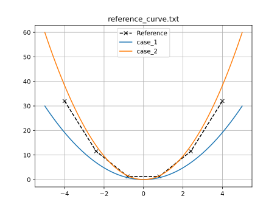
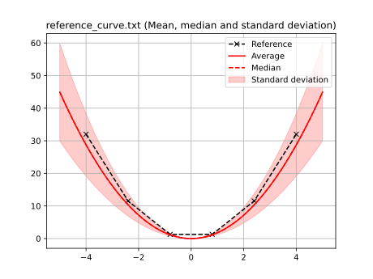
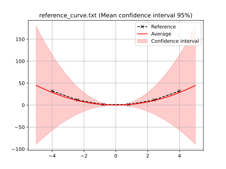

## Stochastic curve fitting example

A simple analytical curve fitting problem with noise in the input data is included to demonstrate how to use `piglot` to optimise stochastic objectives.
Like the in the [sample curve fitting example](../sample_curve_fitting/description.md), we are trying to fit using a numerically generated reference response from the expression $f(x) = 2 x^2$ (provided in the `examples/sample_curve_fitting_stochastic/reference_curve.txt` file).

**Note:** Stochastic optimisation is not supported by most optimisers.
Currently, only Bayesian optimisation with BoTorch supports the full version of the stochastic objective.
However, for a simpler version that is compatible with all optimisers, check the [final section](#ignoring-variance) of this document.

To simulate stochasticity, we use two analytical expressions for describing the curve:
$$
\begin{aligned}
&f_1(x) = a x^2 \\
&f_2(x) = 2a x^2
\end{aligned}
$$
We can compute the scalar loss function with respect to the parameter optimise for each curve individually: $\mathcal{L}_1(a)$ and $\mathcal{L}_2(a)$.
With these, we want to optimise a stochastic function $\mathcal{L}(a)$ which, for every parameter $a$, is assumed to follow a normal distribution with known mean $\mu(a)$ and variance $\sigma^2(a)$, that is, $\mathcal{L}(a) \sim \mathcal{N}\left(\mu(a), \sigma^2(a)\right)$.
These quantities are constructed using mean of the two functions $\mathcal{L}_1(a)$ and $\mathcal{L}_2(a)$ and its respective standard error:
$$
\begin{aligned}
&\mu(a) = \dfrac{1}{N}\sum_{i=1}^{N} \mathcal{L}_i(a) = \dfrac{\mathcal{L}_1(a)+\mathcal{L}_2(a)}{2} \\
&\sigma^2(a) = \dfrac{1}{N^2}\sum_{i=1}^{N} \left[\mathcal{L}_i(a) - \mu(a)\right]^2 = \dfrac{\left[\mathcal{L}_1(a)-\mu(a)\right]^2+\left[\mathcal{L}_2(a)-\mu(a)\right]^2}{4}
\end{aligned}
$$
Note that we use the (squared) standard error of the two functions as the variance of our stochastic model.
This allows us to establish confidence intervals for the mean and, importantly, is the standard approach to simulate observation noise in our function evaluations.

**Note:** This procedure optimises the mean of the *loss functions*, not the mean response. If you wish to optimise the later, check the example on [composite stochastic optimisation](../sample_curve_fitting_stochastic_composite/description.md).

The good news: `piglot` automatically handles computing these quantities for supported objectives.
The configuration file (`examples/sample_curve_fitting_stochastic/config.yaml`) for this example is:
```yaml
iters: 10

optimiser: botorch

parameters:
  a: [1, 0, 4]

objective:
  name: fitting
  stochastic: True
  solver:
    name: curve
    cases:
      'case_1':
        expression: <a> * x ** 2
        parametric: x
        bounds: [-5, 5]
        points: 100
      'case_2':
        expression: 2* <a> * x ** 2
        parametric: x
        bounds: [-5, 5]
        points: 100
  references:
    'reference_curve.txt':
      prediction: ['case_1', 'case_2']
```
As you can see, both functions have been passed as separate cases for the curve solver and, at the end, the reference is compared with the list of two cases.
This syntax is equivalent to saying: *optimise the mean of these two cases*.
Finally, to pass variance information to the optimiser, we add the option `stochastic: True` to the objective.
The rest of the file is identical to our [curve fitting example](examples/sample_curve_fitting/description.md).
Example output for this case:
```
BoTorch: 100%|████████████████████████████████████████| 10/10 [00:00<00:00, 14.42it/s, Loss: 1.7315e-01]
Completed 10 iterations in 0.69363s
Best loss:  1.73146009e-01
Best parameters
- a:     1.198191
```
Piglot identifies the `a` parameter as 1.2, and the error of the fitting is in the order of $10^{-1}$.
Note that this large error is expected.
Unlike the other cases, there isn't a value for `a` whose mean of the loss of the two functions exactly recovers the reference response.

Under stochasticity, two additional plots are created to display both (i) the standard deviation of the model and (ii) the confidence interval for the mean.
By using `piglot-plot` with the `best` option, you should get an output similar to
```
Best run:
Start Time /s    0.683277
Run Time /s      0.014079
Variance         0.005519
a                1.198191
Name: 18, dtype: object
Hash: f07c094fdbbaa637387a31cdeeb946783f4b3aeefe99639995d7e6539cf48475
Objective:  1.73146009e-01
```
And the following plots:





### Ignoring variance

If you wish to use other optimisers, the objective can be constructed in a fashion that drops the variance information and allows for directly opimising the mean of a set of cases.
To use this, simply unset the `stochastic` flag from the configuration file (either by setting it to `False` or removing it altogether).
If you repeat this example with the aforementioned flag unset, you should expect a similar outcome from the optimisation:
```
BoTorch: 100%|████████████████████████████████████████| 10/10 [00:00<00:00, 13.13it/s, Loss: 1.7314e-01]
Completed 10 iterations in 0.76140s
Best loss:  1.73143625e-01
Best parameters
- a:     1.199068
```
However the optimiser is not aware of the variance of the objective function.
Similarly, if you run `piglot-plot`, you should only expect a single figure with both responses:

