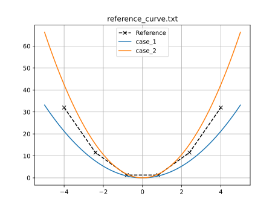
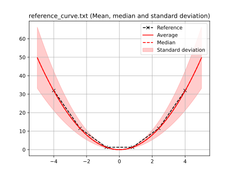
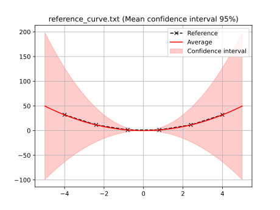

## sample_curve_fitting_stochastic_composite example

A simple analytical curve fitting problem with noise in the input data is included to demonstrate how to use `piglot` with variance and with the composite strategy.
In this case, we aim to fit two quadratic expressions of the type $f(x) = a x^2$ and $f(x) = 2a x^2$, using as a reference response, a numerically generated reference from the expression $f(x) = 2 x^2$ (provided in the `examples/sample_curve_fitting_stochastic/reference_curve.txt` file).
We want to find the value for $a$ that better fits our reference. In this case, the optimal solution is no longer $a=2$, as two distinct functions are used to compute the generated response.

We run 10 iterations using the `botorch` optimiser (our interface for Bayesian optimisation), and set the parameter `a` for optimisation with bounds `[0,4]` and initial value 1.
The notation `<a>` indicates that this parameter should be optimised.
We also define a parameterisation using the variable $x$, where we sample the function between `[-5,5]` with 100 points.


DESCRIBE STOCHASTIC

The configuration file (`examples/sample_curve_fitting_stochastic_composite/config.yaml`) for this example is:
```yaml
iters: 10

optimiser: botorch

parameters:
  a: [1, 0, 4]

objective:
  name: fitting
  stochastic: True
  composite: True
  solver:
    name: curve
    cases:
      'case_1':
        expression: <a> * x ** 2
        parametric: x
        bounds: [-5, 5]
        points: 100
      'case_2':
        expression: 2* <a> * x ** 2
        parametric: x
        bounds: [-5, 5]
        points: 100
  references:
    'reference_curve.txt':
      prediction: ['case_1', 'case_2']
```
The stochastic strategy is activated by setting ```stochastic: True```, and by adding a new generated response with the label `case_2`, given by the expression $f(x) = 2a x^2$. The composite strategy is activated by setting ```composite: True```.

To run this example, open a terminal inside the `piglot` repository, enter the `examples/sample_curve_fitting_stochastic_composite` directory and run piglot with the given configuration file
```bash
cd examples/sample_curve_fitting_stochastic_composite
piglot config.yaml
```
You should see an output similar to
```
BoTorch: 100%|████████████████████████████████████████| 10/10 [00:02<00:00,  3.80it/s, Loss: 5.2804e-05]
Completed 10 iterations in 2s
Best loss:  5.28041030e-05
Best parameters
- a:     1.325847
```
Piglot identifies the `a` parameter as 1.326, and the error of the fitting is in the order of $10^{-6}$, which is much smaller than the error obtained with the non-composite strategy (see [here](../sample_curve_fitting_stochastic/description.md)).


To visualise the optimisation results, use the `piglot-plot` utility.
In the same directory, run
```bash
piglot-plot best config.yaml
```
Which will display the best observed value for the optimisation problem.
You should see the following output in the terminal
```
Best run:
Start Time /s    2.595121
Run Time /s      0.014108
Variance         0.018073
a                1.325847
Name: 18, dtype: object
Hash: fc36fad0fc55278da3c16dbfd9a257e42c2d81361e8650236013ab6f6426c104
Objective:  5.28041030e-05
```
The script plots the best observed responses, and its comparison with the reference response. Moreover, the average, the median, the standard deviation and the 95\% mean condidence intervals are also provided.



As can be seen, with the composite strategy, the mean of the responses is in excellent agreement with the reference response.

